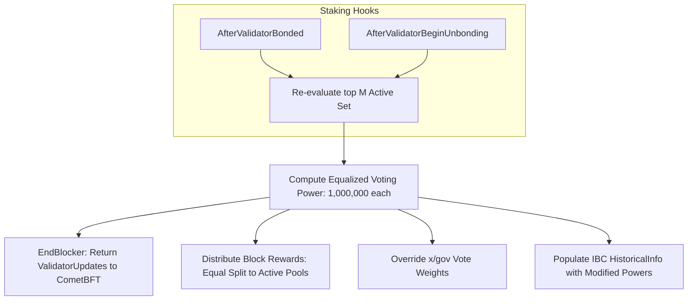

# ADR 001: Validator Set Cardinality & Staking Compatibility

## Context & Problem Statement
Sovereign L1 seeks to implement a decentralized network that prevents validator power centralization. Standard Cosmos SDK utilizes a stake-weighted voting power model, which inherently leads to oligopoly where a small group of highly capitalized validators controls consensus. We require a system with a fixed validator cardinality and a non-stake-weighted partition scheme where every active validator possesses identical consensus weight.

## Proposed Design

### 1. Active Set Cardinality & Slotting
- The active validator set is capped at exactly $M = 30$ slots.
- Admission to the active set is based on the total amount of bonded self-delegated tokens.
- Validators are sorted in descending order of bonded tokens. The top $M$ validators are designated as active.
- If a tie occurs at the $M$-th boundary, the validator with the earlier registration timestamp (`CreationHeight` and `Timestamp`) is selected.

### 2. Equalized Voting Power Formula
Regardless of the absolute amount of bonded tokens, each active validator is assigned an equal voting power of $1,000,000$ (representing 1 unit of power in CometBFT to prevent precision loss).
The voting power $VP_i$ for any registered validator $i$ at block height $H$ is defined as:

$$VP_i = \begin{cases} 1,000,000 & \text{if } \text{rank}(i) \le M \\ 0 & \text{if } \text{rank}(i) > M \end{cases}$$

During the `EndBlocker` phase of the custom staking module, validator updates returned to the CometBFT consensus engine are intercepted. The actual token-based power updates are rewritten to match this uniform distribution.

### 3. Module Compatibility & Hooks

#### A. Staking Hooks & `EndBlocker`
- The staking module registers hooks (`AfterValidatorBonded`, `AfterValidatorBeginUnbonding`, `AfterValidatorCreated`) to track membership changes.
- The `EndBlocker` module logic iterates over the active set and generates `abci.ValidatorUpdate` structs overriding the `Power` field to `1,000,000`.

#### B. `x/distribution` Compatibility
Standard `x/distribution` distributes rewards proportionally to voting power. Because voting powers are equalized, block rewards are split equally among active validator pools:

$$\text{ValidatorReward}_i = \frac{\text{Total Block Provision}}{M}$$

To preserve individual delegator incentives:
- The base reward allocated to the validator's pool is equalized.
- Inside that validator's pool, delegation shares dictate the payout ratio for delegators. If Delegator $j$ owns $10\%$ of Validator $i$'s pool, they receive $10\%$ of Validator $i$'s equalized share.

#### C. `x/gov` Voting Override
Governance voting power in the Cosmos SDK is computed from the total delegation weight of the validator. To prevent governance weights from deviating from consensus weights:
- Each active validator's vote in governance is capped at a maximum weight of $1/M$ (i.e. $1/30$, or $3.33\%$) of the total voting power.
- If delegators choose to override their validator's vote, their delegator voting power is scaled relative to their fraction of that validator's total delegation:

$$\text{DelegatorGovPower}_j = \frac{\text{Delegation}_j}{\text{TotalDelegation}_i} \times \frac{1}{M}$$

#### D. `x/slashing` Behavior
- Double-sign and downtime slashing fractions are applied directly to the validator's bonded tokens.
- However, since every validator has equal consensus weight, the consensus impact of one validator going offline is exactly $1/M$ ($3.33\%$).

#### E. IBC `HistoricalInfo` Integration
- The Cosmos SDK stores `HistoricalInfo` (validator set state and header information) at each height for IBC proof validation.
- We override the validator power records inside the stored `HistoricalInfo` to represent the equalized $1,000,000$ power. This prevents light clients on foreign chains from rejecting consensus proofs due to validator power mismatch.

## Alternatives Considered
- **Stake-Weighted Voting with Cap**: Limit maximum validator voting power to a percentage (e.g. 5%). This was rejected because it still permits plutocratic collusion and does not guarantee equal say in block production.
- **Dynamic Validator Cardinality**: Adjusting $M$ based on total network stake. Rejected as it introduces unpredictability in block verification times and consensus overhead.
