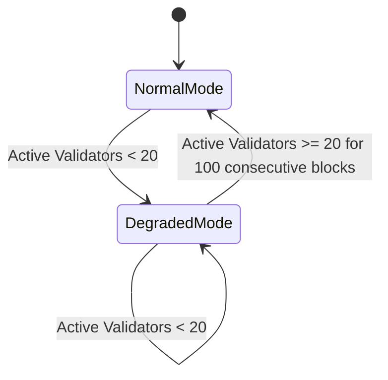

# ADR 002: Liveness & Certification Engine

## Context & Problem Statement
Sovereign L1 requires high liveness guarantees. A naive liveness engine in a fixed validator set (size $M=30$) can cause cascading failures: if multiple validators are jailed due to transient network issues, the network can drop below the $2/3$ consensus threshold, halting the chain. We need a deterministic, state-driven "Degraded Mode" to adjust liveness requirements during network distress, alongside clear specifications for vote extensions.

## Proposed Design

### 1. Rolling Liveness Window & Bootstrapping
Liveness is tracked using a rolling window of $W = 10,000$ blocks. Under normal conditions, a validator must sign at least $K = 5,000$ blocks ($50\%$) within the window.

#### Bootstrapping Formula
For heights $H$ less than the window size $W$, a partial denominator is applied to prevent false-positive jailing. The required signing threshold $T(H)$ is scaled dynamically:

$$T(H) = \begin{cases} 0 & \text{if } H < 100 \\ \left\lfloor H \times \frac{K}{W} \right\rfloor & \text{if } 100 \le H < W \\ K & \text{if } H \ge W \end{cases}$$

This ensures no jailing occurs in the first 100 blocks, allowing the validator set to stabilize at genesis.

### 2. State-Driven Degraded Mode
When the number of active signing validators drops below $20$ (representing $< 2/3$ of the $M=30$ active slots), the chain enters **Degraded Mode** to prevent total network halt.

- **Trigger Condition**: Evaluated at each block $H$ via `LastCommitInfo`. If the count of validators who signed the block is $< 20$, the chain transitions to Degraded Mode at $H+1$.
- **State Changes under Degraded Mode**:
  - **Liveness Threshold Reduction**: The signing threshold for the rolling window is reduced from $50\%$ to $30\%$ ($K_{degraded} = 3,000$).
  - **Consensus Timeout Scaling**: The consensus timeouts (`TimeoutPropose`, `TimeoutPrevote`, `TimeoutPrecommit`, `TimeoutCommit`) are multiplied by $2.0$ dynamically. This is passed to CometBFT on-chain via consensus parameter updates.
- **Recovery Condition**: The chain returns to Normal Mode only when the active signing count is $\ge 20$ for $100$ consecutive blocks.

### 3. Vote Extension Policy (CometBFT)
Sovereign L1 leverages CometBFT Vote Extensions to distribute attestation signatures. Validators must append these signatures to their pre-commit votes.

| Vote Extension State | Verification Result | Protocol Action / Penalty |
| :--- | :--- | :--- |
| **Absent / Missing** | No extension attached | Minor penalty: $0.01\%$ validator reward deduction for the block. |
| **Malformed** | Signature verification fails | Critical penalty: Immediate jailing for $1,000$ blocks, validator set update triggered. |
| **Empty / Zeroed** | Attached, but payload is empty | Permissible fallback (e.g. validator is synced but oracle/bridge state is missing). Streak of $>50$ consecutive empty extensions triggers downtime jailing. |

#### Verification Mechanics
During `PrepareProposal`, the proposer aggregates the vote extensions from the previous block. The application verifies these extensions in `ProcessProposal`. If a malformed extension is detected, the block is rejected, forcing the network to round-robin to a proposer that filters out the invalid signature.
