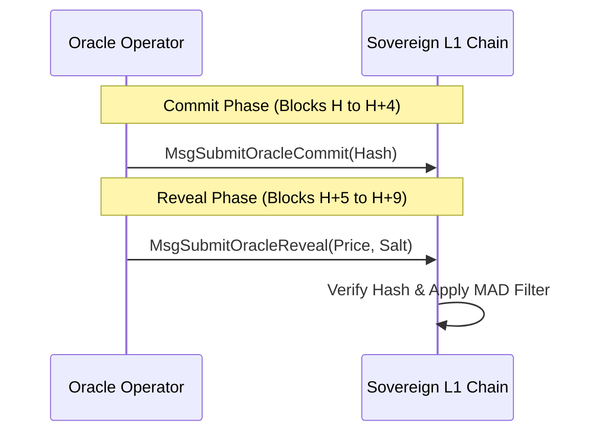

# ADR 003: Oracle Commit-Reveal & Staleness Engine

## Context & Problem Statement
Sovereign L1 requires a highly secure and manipulation-resistant price feed oracle. Single-block price pushes are vulnerable to frontrunning, flash-loan manipulation, and validator censorship. Additionally, if the source networks (e.g., BSC) experience outages, the oracle must handle the resulting price staleness gracefully without causing dependent financial milestones on the L1 chain to expire and fail.

## Proposed Design

### 1. Two-Message Commit-Reveal Flow
Every oracle round operates across two distinct windows: a Commit Window of $C = 5$ blocks followed by a Reveal Window of $R = 5$ blocks.

#### A. Commit Phase
During the Commit Window, each oracle operator submits a cryptographic commit hash $H$:

$$H = \text{keccak256}(\text{price} \parallel \text{salt} \parallel \text{operator\_address})$$

Where `salt` is a cryptographically secure random 256-bit value.

#### B. Reveal Phase
During the Reveal Window, operators submit `MsgSubmitOracleReveal` containing the raw `price` and `salt`.
The state machine verifies that:

$$\text{keccak256}(\text{price} \parallel \text{salt} \parallel \text{sender}) == H_{\text{stored}}$$

#### C. Penalty for Failure to Reveal
If an operator successfully submits a commit but fails to submit a valid reveal within the Reveal Window:
- They are slashed by $1\%$ of their total staked oracle self-delegation.
- They are suspended from participation in the oracle set for $500$ blocks.

### 2. Median Absolute Deviation (MAD) Outlier Filtration
To filter out malicious or erroneous prices, the aggregation engine uses the Median Absolute Deviation (MAD) filter. Let the set of revealed prices be $X = \{x_1, x_2, \dots, x_n\}$.

1. Find the median price:
   
   $$M_X = \text{median}(X)$$

2. Calculate the absolute deviation for each price:
   
   $$D_i = |x_i - M_X|$$

3. Compute the MAD value:
   
   $$\text{MAD} = \text{median}(\{D_1, D_2, \dots, D_n\})$$

   *If $\text{MAD} == 0$, set $\text{MAD} = 10^{-6} \times M_X$ as a fallback threshold to prevent division by zero.*

4. Calculate the modified Z-score $M_i$ for each oracle's price:
   
   $$M_i = \frac{0.6745 \times (x_i - M_X)}{\text{MAD}}$$

5. Filter prices:
   An oracle price $x_i$ is discarded as an outlier if $|M_i| > 3.0$.
   The final round price is the mathematical average of the remaining filtered prices.

### 3. Outage & Staleness Clock
If the source network (BSC) suffers an outage, oracles cannot fetch fresh data.
- Oracles submit a standard commit containing a special marker payload (`BSC_OUTAGE`).
- If the count of valid reveals in a round drops below a quorum of $2/3$ ($20$ of $30$ slots), the round is flagged as **Stale**.
- The chain carries over the last valid aggregated price.

#### Staleness Clock Pause Rule
Dependent modules contain time-locked milestones (e.g. cross-chain bridge settlement deadlines) that expire after $D$ blocks. If the price remains stale:
- After $3$ consecutive stale rounds, the oracle engine emits a `stale-blocked` state.
- **Clock Pause**: While `stale-blocked` is active, the deadline blocks for all active milestones are paused. The remaining blocks to expiration are held constant:

$$\text{BlocksRemaining}_{\text{effective}} = \text{DeadlineHeight} - \text{CurrentHeight} + \text{StaleDuration}$$

- **Recovery**: Normal clock operation resumes only after $3$ consecutive rounds are completed successfully with $\ge 20$ valid, non-outlier price reveals.
