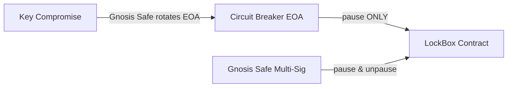

# ADR 004: Bridge Security Model & Threat Analysis

## Context & Problem Statement
Cross-chain bridges are high-value targets for exploits. Vulnerabilities often arise from predictable nonces (leading to replay attacks), short finality depths (exposed to chain reorganizations), and lack of rapid pause mechanisms during active exploits. Additionally, relayers require a deterministic submission strategy to avoid race conditions and double-spending transaction fees.

## Proposed Design

### 1. Hash-Based Nonce Model
To prevent replay attacks and race conditions, the BSC `LockBox` contract generates a unique, unpredictable nonce on-chain when a user locks tokens. The user cannot supply their own nonce. The nonce is computed as:

$$\text{nonce} = \text{keccak256}(\text{msg.sender} \parallel \text{block.number} \parallel \text{amount} \parallel \text{block.timestamp})$$

This hash-based nonce serves as the absolute identifier for the lockup event.

### 2. Tiered Finality Depth
To mitigate BSC chain reorganization risks, confirmation depth is tiered based on the transfer value (evaluated using the oracle price feed):

- **Standard Transfers** ($< \$50,000$ USD): Require $N = 15$ BSC blocks.
- **Large Transfers** ($\ge \$50,000$ USD): Require $N = 50$ BSC blocks.

These thresholds are controlled via Sovereign L1 governance parameters.

### 3. Bitmap Confirmation Registry & Out-of-Order Execution
To allow out-of-order execution while preventing double-spend, the Sovereign L1 bridge module records processed nonces in a bitmap structure instead of requiring sequential nonce execution.

- **Storage Structure**:
  
  ```solidity
  // Map user to block of nonces (grouped by the first 248 bits of the nonce)
  mapping(address => mapping(uint256 => uint256)) processedBitmaps;
  ```

- **In-flight Limit**: To prevent resource exhaustion, each user address is limited to a maximum of $256$ in-flight, unconfirmed nonces at any given time.

### 4. Dual-Control Emergency Pause (Circuit Breaker)
To defend against active exploits, the `LockBox` contract implements a dual-role access control structure:



- **Circuit-Breaker EOA**: An Externally Owned Account controlled by a automated security scanner. It possesses the permission to call `pause()`. It cannot unpause, access funds, or rotate keys.
- **Gnosis Safe Multi-Sig**: A 4-of-6 multi-sig key set (comprising 2 founders, 2 security council members, 2 lead validators) that can call `pause()`, `unpause()`, and perform administrative upgrades.
- **Compromise Runbook**: In the event that the Circuit-Breaker EOA is compromised and performs malicious pausing, the Gnosis Safe executes a role rotation transaction, revoking the EOA's pause role and assigning it to a newly generated address.

### 5. Relayer Submitter Promotion Ladder
To prevent race conditions where multiple relayers submit the same proof to Sovereign L1 (wasting gas), submission rights are distributed using a deterministic delay ladder.

For a transaction with nonce hash $H$ and $R$ active relayers:

1. The designated submitter index is calculated as:
   
   $$\text{DesignatedIndex} = H \pmod R$$

2. Every relayer $i$ calculates their local delay $D_i$ (in L1 blocks) before they are permitted to submit the proof:
   
   $$D_i = ((i - \text{DesignatedIndex} + R) \bmod R) \times \text{delay\_factor}$$

   - Where $\text{delay\_factor} = 5$ blocks.
   - The designated relayer ($D_i = 0$) submits immediately.
   - If they fail, the next relayer in the index becomes eligible after 5 blocks, and so on.
   - If a transaction remains unsubmitted for $> 100$ L1 blocks, the ladder is bypassed, a stuck transaction alert is emitted, and any relayer can submit.
