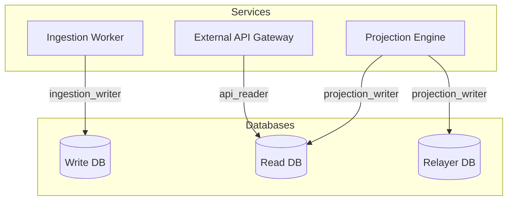

# ADR 005: CQRS & NATS Topology

## Context & Problem Statement
Sovereign L1 utilizes a Command Query Responsibility Segregation (CQRS) architecture to separate transaction ingestion from query projections. If a single database credential or NATS stream is shared across all modules, a compromise in the API layer could lead to data corruption in the ingestion layer. Additionally, high-throughput transactions can produce events exceeding the default message size limits of NATS (1 MB).

## Proposed Design

### 1. Database Privilege Isolation
We enforce schema and user-level isolation across three distinct database instances:



- **`ingestion_writer`**: Used by the ingestion worker. Has read/write privileges *only* on the Write DB (`sovereign_write` schema). Cannot access read or relayer schemas.
- **`projection_writer`**: Used by the projection engines. Has read/write/delete privileges on the Read DB (`sovereign_read` schema) and Relayer DB (`sovereign_relayer` schema). Cannot read or write to the primary Write DB.
- **`api_reader`**: Used by API Gateway. restricted strictly to read-only `SELECT` statements on the Read DB. Has no write privileges.

### 2. NATS Account Isolation & NKeys
NATS uses NKeys (Ed25519-based keys) for authentication and authorization.

- **Account Topology**:
  - `IngestionAccount`: Allowed to publish *only* to `ingest.*`. Cannot subscribe to any topics.
  - `ProjectionAccount`: Allowed to subscribe to `ingest.*` and publish to `projection.*`.
  - `APIAccount`: Allowed to subscribe *only* to `projection.*`. Cannot publish.
- **Credentials Storage**: All credentials (NKey files) are generated and stored in HashiCorp Vault. Rotation is automated and occurs annually.

### 3. Event Size Reference Pointer Fallback
NATS restricts max message size to $1 \text{ MB}$. For transactions containing large smart contracts or blocks with many events, we implement a fallback reference pointer pattern:

If the serialized event payload size $P$ exceeds $900 \text{ KB}$:
1. The producer uploads the payload to a secure object storage bucket (e.g. Amazon S3 or Google Cloud Storage) with a path based on its SHA-256 hash.
2. The producer publishes a reference pointer message to NATS:
   
   ```json
   {
     "type": "REF_POINTER",
     "url": "s3://sovereign-payloads/events/sha256-hash",
     "sha256": "4a7f3984e..."
   }
   ```
   
3. The consumer intercepts the `REF_POINTER` header, downloads the payload, verifies the SHA-256 hash, and deserializes the payload locally.

### 4. PostgreSQL Replication, Backup & Partitioning

#### A. Multi-Region Replication
- **Primary Database**: Deployed in Region A.
- **Standby Database**: Deployed in Region B as a synchronous standby.
- **Replication Configuration**:
  
  ```ini
  synchronous_commit = on
  synchronous_standby_names = 'first 1 (standby_B)'
  ```
  
- **Failover**: Managed via Patroni using etcd for consensus.

#### B. Backup and Restore Lifecycle
- **WAL Archiving**: Continuous Write-Ahead Log (WAL) archiving to cloud storage (e.g., S3) via pgBackRest.
- **Base Backups**: Automated daily full database backups.
- **Point-in-Time Recovery (PITR)**: Backups enable restoration to any microsecond within a 30-day window.

#### C. Database Table Partitioning
- The primary Write DB stores raw block events. The main event table is partitioned monthly by `block_height`.
- **Retention**:
  - Hot partitions: Kept online for 6 months.
  - Cold partitions: Detached, compressed, and archived to cold cloud storage (S3 Glacier) after 6 months.
