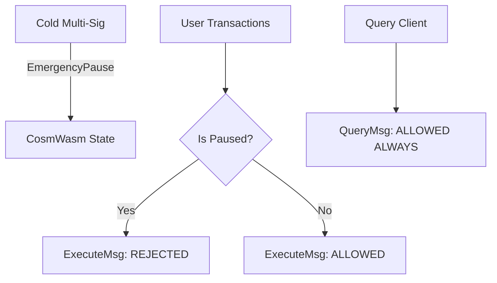

# ADR 006: CosmWasm Governance & Reentrancy Guards

## Context & Problem Statement
CosmWasm contracts executed on Sovereign L1 handle the Treasury and Reserve token supplies. Although CosmWasm's actor model avoids direct EVM-style call-stack reentrancy, it remains vulnerable to *asynchronous reentrancy* via submessage callbacks (`reply`). We require strict reentrancy guards on all financial contracts. Furthermore, we must establish a gas-limiting regime and a cold multi-sig emergency pause mechanism that allows quick intervention while keeping state queries transparent.

## Proposed Design

### 1. Asynchronous Reentrancy Guard
To prevent reentrancy during submessage execution, we implement a state-based reentrancy lock inside the CosmWasm contracts.

```rust
use cosmwasm_std::{Response, StdResult, Storage};
use cw_storage_plus::Item;

const REENTRANCY_LOCK: Item<bool> = Item::new("reentrancy_lock");

pub fn acquire_lock(storage: &mut dyn Storage) -> Result<(), ContractError> {
    if REENTRANCY_LOCK.load(storage).unwrap_or(false) {
        return Err(ContractError::ReentrancyBlocked {});
    }
    REENTRANCY_LOCK.save(storage, &true)?;
    Ok(())
}

pub fn release_lock(storage: &mut dyn Storage) -> StdResult<()> {
    REENTRANCY_LOCK.save(storage, &false)
}
```

- **Execution Flow**:
  1. At the start of `execute()`, call `acquire_lock()`.
  2. If a submessage is dispatched, the lock remains `true`.
  3. The blockchain processes the submessage and returns execution control to the contract's `reply()` handler.
  4. The contract processes the reply payload, releases the lock via `release_lock()`, and returns the final `Response`.

### 2. Gas Limit Controls & Proposal Bypasses
- **Initial Gas Limit**: $500,000$ gas per CosmWasm transaction.
- **Adjustable Bounds**: Governance can adjust the gas limit, constrained to the range $[100,000, 2,000,000]$. Bounds checks are enforced inside the `MsgUpdateParams` handler.
- **Constitution Bypass**: Proposals targeting gas limit adjustments or `MsgMigrateContracts` bypass standard constitutional check periods. This ensures that in a gas-starved deadlock, governance can immediately raise gas limits to restore network execution.

### 3. Emergency Override Cold Multi-Sig
We establish a 5-of-7 cold multi-sig consisting of hardware wallet keys (Ledger/Trezor) distributed globally to manage emergency overrides.

#### A. Key Holder Composition
- **Founding Team**: 2 keys
- **Independent Security Council**: 2 keys
- **Lead Validators**: 2 keys
- **Legal Trustee**: 1 key

Key holders must be geographically distributed across at least 4 jurisdictions to mitigate physical coercion risk. Key rotation can only occur via a time-locked governance proposal (7-day execution delay).

#### B. Pause Mechanics and Scope



- **Execute Block**: When `EmergencyPause` is invoked by the multi-sig, all state-modifying entry points (`ExecuteMsg`) in the Treasury and Reserve contracts immediately return error codes and revert transaction states.
- **Query Allow**: Read-only entry points (`QueryMsg`) are never blocked. Users and governance tools must always be able to query system balances and transaction history, ensuring full transparency during a pause.
- **Unpause**: Can only be executed by the multi-sig or via a standard governance vote.
