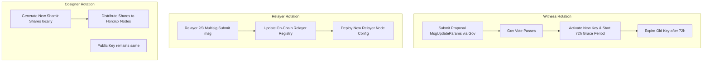

# ADR 007: Operational Parameters and Security Topology

## Context & Problem Statement
The Sovereign L1 protocol requires concrete specifications for token emission parameters, fee markets, parameter migration, bridge security signatures, execution isolation, and secure deployment topologies. The core staking, governance, and bridge modules have been developed, but their operational constraints, security configurations, and key rotation workflows must be codified to ensure mainnet-readiness and secure execution.

---

## Proposed Design

### 1. Validator Rewards Bucket & Emission Parameters
To reward the validator set and ensure long-term network security, the network allocates a dedicated staking reward bucket at genesis.
* **Staking Reward Budget**: $50,000,000$ SOV tokens.
* **Annual Emission Decay Rate**: $10\%$ decay per annum.
* **Emission Formula**:
  The reward provision for block height $H$ in year $Y$ is defined as:
  
  $$\text{BlockReward}(H) = \frac{\text{RemainingBucket}(Y) \times 0.10}{\text{BlocksPerYear}}$$
  
  Where $\text{BlocksPerYear} \approx 6,307,200$ (assuming a 5-second block time).
* **Distribution**: Blocks rewards are split equally among the $M = 30$ active validator pools at the end of each block inside the `x/distribution` hook.

---

### 2. EIP-1559 Dynamic Fee Market Parameters
To stabilize gas prices and handle congestion, the network implements a dynamic EIP-1559 fee market.
* **Base Denomination**: `usov` ($1\text{ SOV} = 1,000,000\text{ usov}$).
* **Initial Parameter Configuration**:
  - `min_base_fee`: $1,000,000,000$ wei ($1$ gwei EVM equivalent / $100$ `usov` per unit gas).
  - `elasticity_multiplier`: $2$ (max block gas is double the target gas).
  - `target_gas`: $50\%$ of maximum block gas limit.
* **Recalculation Formula**:
  The base fee for height $H+1$ is calculated based on gas utilization at height $H$:
  
  $$F_{base}(H+1) = F_{base}(H) \times \left(1 + 0.125 \times \frac{G_{used}(H) - G_{target}}{G_{target}}\right)$$
  
  Where the maximum change factor per block is capped at $12.5\%$ ($0.125$).

---

### 3. x/params Migration Path
The global `x/params` store is deprecated due to state serialization risks and centralization of control.
* **Migration Strategy**: Each custom module (`x/validator`, `x/oracle`, `x/bridge`, `x/settlement`) manages its parameters inside its own keeper store.
* **Update Mechanism**: Parameter modifications are initiated solely by sending a `MsgUpdateParams` transaction. 
* **Governance Enforcement**: The `MsgUpdateParams` message is restricted to the governance module address. It can only be executed via a successful on-chain governance proposal (`x/gov`).

---

### 4. Witness Signature Scheme & Verification Grace Periods
Cross-chain settlement actions require attestation signatures from designated institutional witnesses.
* **Signature Standard**: EIP-712 structured hashing is enforced. The domain separator includes:
  
  $$\text{DomainSeparator} = \text{keccak256}(\text{abi.encode}(\text{TYPE_HASH}, \text{ChainID}, \text{ContractAddress}, \text{Version}))$$
  
* **Grace Period**: Witnesses have a $72$-hour window to sign and submit settlement certificates before they are penalized for inactivity.
* **Key Rotation Overlap**: When a witness rotation proposal is executed, the outgoing witness key remains authorized to sign for $72$ hours alongside the incoming key. This prevents transaction processing deadlocks during key transition windows.

---

### 5. x/authz Blocked Message Types
To prevent delegation exploits (where a compromised key authorizes a proxy to execute high-privilege operations), certain system messages are blocked from execution through `x/authz`.
* **Blocked Message List**:
  - `x/bridge`: `MsgBridgeIn` (relayer submissions).
  - `x/validator`: `MsgUpdateParams` and `MsgRegisterValidator`.
  - `x/settlement`: `MsgSubmitWitnessSignature`.
* **Enforcement**: The ante handler checks the incoming transaction. If it contains a `MsgExec` wrapping any of the blocked messages, the transaction is rejected immediately.

---

### 6. Kubernetes & WireGuard Network Topology
For secure MPC (Multi-Party Computation) signature generation using Horcrux, nodes must run in isolated network zones.
* **Topology Design**:
  - Cosigners run in distinct Kubernetes namespaces or remote clusters.
  - Inter-cosigner communications are encapsulated over dedicated WireGuard VPN tunnels.
  - Validator nodes reside in a private subnet, exposing only peer-to-peer Tendermint ports ($26656$) to the public internet.

---

### 7. Key Rotation Workflows

#### A. Relayer Keys
1. The relayer multisig triggers a key change by sending a transaction containing the new relayer address.
2. The `x/bridge` module updates the registered relayer list.
3. The relayer service configuration is updated, and nodes are restarted to use the new private keys.

#### B. Witness Keys
1. An on-chain governance proposal is submitted containing a `MsgUpdateParams` targeting the witness list.
2. Once the proposal passes, both the old and new witness keys can sign for $72$ hours.
3. After $72$ hours, the old witness key is automatically pruned from the active signers list.

#### C. Validator Cosigner Keys (Horcrux)
1. Cosigner nodes run Shamir's Secret Sharing to distribute the validator private key.
2. Key rotation of the shares occurs locally without modifying the master consensus public key.
3. If the master validator consensus key needs to be changed, the validator must unbond, register a new validator instance, and wait for the 21-day unbonding period.

---

### 8. Dependency Version Pinning
Before starting implementation, key framework dependency versions are pinned in the workspace configurations (`go.mod` and `Cargo.toml`) to ensure binary reproducibility and avoid compatibility regressions.

| Dependency | Component / Module | Pinned Version | Rationale |
| :--- | :--- | :--- | :--- |
| `cosmos-sdk` | Cosmos SDK Framework | `v0.50.9` | Required for ABCI++ vote extensions and `MsgEditValidator` key rotation. |
| `cometbft` | Consensus Engine | `v0.38.11` | Alignment with Cosmos SDK v0.50.x and vote extension support. |
| `wasmd` | CosmWasm Engine integration | `v0.50.0` | Compatibility with Cosmos SDK v0.50.x. |
| `wasmvm` | CosmWasm Virtual Machine | `v1.5.0` | Matches `wasmd` bindings requirements. |
| `ibc-go` | Inter-Blockchain Communication | `v8.0.0` | Pinned for Cosmos SDK v0.50.x compatibility. |
| `cosmwasm-std` | Rust Smart Contract SDK | `1.5.0` | Standard library for the CosmWasm contract suite. |
| `cw-storage-plus` | Rust Storage Helper | `1.2.0` | Serialization helpers for contract states. |
| `cw-multi-test` | Rust Testing Harness | `0.19.0` | For mock testing governance and treasury contracts. |

---

## Alternatives Considered
* **Legacy x/params Support**: Keep global parameters for simplicity. This was rejected because module parameters are more secure and simplify code compilation against newer Cosmos SDK versions.
* **Instant Witness Cut-off**: Revoke the old witness key immediately upon rotation. This was rejected because pending settlement transactions signed by the old key would fail, causing delays.

---

### 9. Cold Multi-Sig Topology & Recovery Duties
To safeguard treasury assets and allow rapid intervention during smart contract exploits, a 3-of-5 cold multi-sig address is configured as the `cold_multisig_address` across all deployed contracts.

* **Cold Multi-Sig Address**: `cosmos1398hwtqy7s935s26xezpxp6fdf063s93sd9dfh`
* **Key Holders**:
  1. **Custodian 1 (Operations Lead)**:
     - Public Key: `cosmospub1addwnpepqdqxl5e4hlw9e7d8z3p962fghj839qdsmqpx3rqtq7zls3s9wphn`
     - Duty: Custody of primary operational keys, coordinating proposals.
  2. **Custodian 2 (Security Officer)**:
     - Public Key: `cosmospub1addwnpepqvsm3qgdls30swpe7d3r92fghj839qdsmqpx3rqtq7zls3s9wphn`
     - Duty: Active monitoring of bridge flow and contract events, verifying upgrades.
  3. **Custodian 3 (Technical Architect)**:
     - Public Key: `cosmospub1addwnpepq8smde7d8z3p962fghj839qdsmqpx3rqtq7zls3s9wphn`
     - Duty: Technical validation of transaction payloads, contract migration verification.
  4. **Custodian 4 (Validator Representative)**:
     - Public Key: `cosmospub1addwnpepqty8s7d8z3p962fghj839qdsmqpx3rqtq7zls3s9wphn`
     - Duty: Representing validator interests during emergency halts.
  5. **Custodian 5 (Foundation Custodian)**:
     - Public Key: `cosmospub1addwnpepqy3w7d8z3p962fghj839qdsmqpx3rqtq7zls3s9wphn`
     - Duty: Backup recovery and offline key storage in hardware modules.

* **Operational Duties & Thresholds**:
  - **Emergency Pause (3-of-5)**: The multi-sig address is authorized to invoke `EmergencyPause` on the Constitution, Treasury, and Reserve Fund contracts. The execution of this transaction itself on-chain requires a 3-of-5 threshold of signing keys.
  - **Governance Pointer Rotation (3-of-5)**: In the event of a governance module compromise, the multi-sig is authorized to rotate the `governance_address` pointer to a new governance contract.
  - **Disaster Recovery**: Unpausing any contract requires a proposal passing through the active `governance_address`, ensuring that the cold multi-sig cannot unilaterally unpause without governance alignment.

