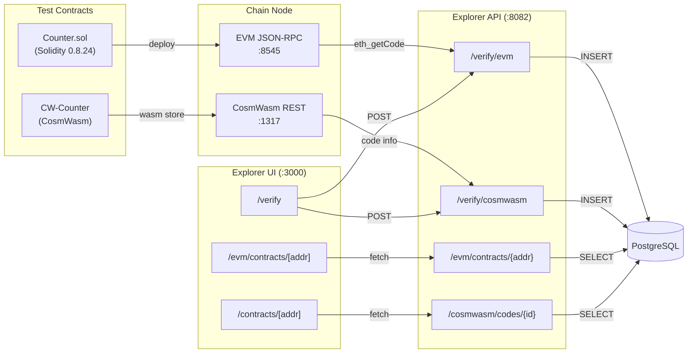

# Sovereign L1 — End-to-End Contract Verification Test Flow

> **Scope**: Compile, deploy, verify, and interactively test both **EVM (Solidity/Sourcify)** and **CosmWasm (SHA-256 Schema)** contracts through the custom Sovereign Explorer.

---

## Architecture Overview



---

## Prerequisites

| Component | Requirement | Verify Command |
|-----------|-------------|----------------|
| Docker | Running with chain-node healthy | `docker ps \| grep chain-node` |
| EVM RPC | Port 8545 accessible | `curl -s http://localhost:8545 -X POST -H "Content-Type: application/json" -d '{"jsonrpc":"2.0","method":"eth_chainId","params":[],"id":1}'` |
| CosmWasm REST | Port 1317 accessible | `curl -s http://localhost:1317/cosmwasm/wasm/v1/codes` |
| Explorer API | Port 8082 accessible | `curl -s http://localhost:8082/api/rest/v1/explorer/status` |
| Explorer UI | Port 3000 accessible | `open http://localhost:3000` |
| Node.js | v18+ with npm | `node --version` |
| Funded Account | Balance > 0 for gas | (see deployer setup below) |

---

## Part 1: EVM Contract (Solidity / Sourcify-Style Verification)

### Step 1.1 — Install Dependencies

```bash
cd e2e/contracts/evm
npm install ethers@6 solc@0.8.24
```

### Step 1.2 — Compile and Deploy

```bash
# Set your EVM RPC and deployer key
export EVM_RPC_URL=http://localhost:8545
export PRIVATE_KEY=0xac0974bec39a17e36ba4a6b4d238ff944bacb478cbed5efcae784d7bf4f2ff80

# Compile + Deploy + Smoke Test
node compile_and_deploy.js
```

**Expected Output:**
```
═════════════════════════════════════════════════════════
  Sovereign L1 — EVM Contract Test Suite
═════════════════════════════════════════════════════════
⏳ Compiling Counter.sol with solc 0.8.24 (optimizer=200)...
✅ Compilation successful
   ABI functions: 13
   Bytecode size: ~2500 bytes
📄 Artifact written to: Counter.artifact.json
🌐 Connecting to EVM RPC: http://localhost:8545
   Chain ID: 7001
   Deployer: 0xf39Fd6e51aad88F6F4ce6aB8827279cffFb92266
   Balance:  100.0 ETH
🚀 Deploying Counter(initialCount=42, label="SovereignTestCounter")...
✅ Contract deployed!
   Address:     0x5FbDB2315678afecb367f032d93F642f64180aa3
   Tx Hash:     0x...
📖 Read test (count)...
   count() = 42
✏️  Write test (increment)...
   count() = 43
```

**Artifacts Generated:**
| File | Purpose |
|------|---------|
| `Counter.artifact.json` | ABI + bytecode for verification |
| `Counter.deploy.json` | Address, tx hash, constructor args |

### Step 1.3 — Record Deployment Data

Copy these values from the deployment output:
- **Contract Address**: `0x...` (from `Counter.deploy.json`)
- **Constructor Args**: `0x...` (from `Counter.deploy.json`)

### Step 1.4 — Verify via Explorer UI

1. Open **http://localhost:3000/verify**
2. Select **"EVM (Solidity)"** tab
3. Fill in the form:

| Field | Value |
|-------|-------|
| Contract Address | `0x...` (from Step 1.3) |
| Compiler Version | `v0.8.24+commit.e11b9ed9` |
| Optimizer | ✅ Enabled, 200 runs |
| Solidity Source Code | Paste contents of `Counter.sol` |
| Artifact JSON | Paste contents of `Counter.artifact.json` |
| Constructor Arguments | `0x...` (from Step 1.3) |

4. Click **"Verify & Publish"**

> [!IMPORTANT]
> The artifact JSON auto-populates the ABI and Bytecode fields. You can also paste them manually.

**Expected Result:**
```json
{
  "success": true,
  "matchType": "partial",
  "address": "0x..."
}
```

### Step 1.5 — Verify via curl (Alternative)

```bash
# Read values from the generated files
ADDRESS=$(jq -r '.address' Counter.deploy.json)
ABI=$(jq '.abi' Counter.artifact.json)
BYTECODE=$(jq -r '.deployedBytecode' Counter.artifact.json)
CTOR_ARGS=$(jq -r '.constructorArgs' Counter.deploy.json)
SOURCE=$(cat Counter.sol)

curl -X POST http://localhost:8082/api/rest/v1/explorer/verify/evm \
  -H "Content-Type: application/json" \
  -d "$(jq -n \
    --arg address "$ADDRESS" \
    --arg sourceCode "$SOURCE" \
    --argjson abi "$ABI" \
    --arg compilerVersion "v0.8.24+commit.e11b9ed9" \
    --argjson optimizerEnabled true \
    --argjson optimizerRuns 200 \
    --arg constructorArgs "$CTOR_ARGS" \
    --arg compiledBytecode "$BYTECODE" \
    '{
      address: $address,
      sourceCode: $sourceCode,
      abi: $abi,
      compilerVersion: $compilerVersion,
      optimizerEnabled: $optimizerEnabled,
      optimizerRuns: $optimizerRuns,
      constructorArgs: $constructorArgs,
      compiledBytecode: $compiledBytecode
    }')"
```

### Step 1.6 — Test Interactive Read/Write

Navigate to **http://localhost:3000/evm/contracts/{ADDRESS}**

**Read Functions to Test:**

| Function | Expected Result |
|----------|-----------------|
| `count()` | `43` (after the deploy script's increment) |
| `owner()` | Deployer address |
| `label()` | `"SovereignTestCounter"` |
| `paused()` | `false` |
| `summary()` | Tuple with all state |
| `getIncrementsByUser(address)` | Enter deployer addr → `1` |

**Write Functions to Test (requires MetaMask):**

| Function | Args | Expected |
|----------|------|----------|
| `increment()` | (none) | count increases by 1 |
| `incrementBy(amount)` | `5` | count increases by 5 |
| `decrement()` | (none) | count decreases by 1 |
| `setLabel(newLabel)` | `"Updated"` | label changes (owner only) |

> [!NOTE]
> MetaMask must be connected to `http://localhost:8545` (Chain ID: 7001) with the deployer account imported.

---

## Part 2: CosmWasm Contract (SHA-256 / Reproducible Build Verification)

### Step 2.1 — Store Contract On-Chain

**Option A: With compiled .wasm binary**
```bash
cd e2e/contracts/cosmwasm

# Copy your compiled .wasm into this directory
cp /path/to/your/cw_counter.wasm ./

# Run the automated test
chmod +x store_and_verify.sh
./store_and_verify.sh
```

**Option B: Using Docker exec with an existing binary**
```bash
# Copy wasm into the container
docker cp cw_counter.wasm chain-node:/tmp/

# Store on-chain
docker exec chain-node chaind tx wasm store /tmp/cw_counter.wasm \
  --from validator \
  --chain-id sovereign-1 \
  --gas-prices 0aesov \
  --gas auto \
  --gas-adjustment 1.3 \
  -y --output json

# Wait for block inclusion
sleep 6

# Get the code ID
docker exec chain-node chaind q wasm list-code --output json | jq '.code_infos[-1]'
```

**Option C: Manual verification without wasm binary**

If you don't have a compiled `.wasm` binary but want to test the verification API workflow:

```bash
# Query an existing code from the chain
CODE_ID=1
CHECKSUM=$(curl -s http://localhost:1317/cosmwasm/wasm/v1/code/${CODE_ID} | jq -r '.code_info.data_hash')
echo "Code ID: ${CODE_ID}, Checksum: ${CHECKSUM}"
```

### Step 2.2 — Record Deployment Data

- **Code ID**: from the store tx result
- **SHA-256 Checksum**: `sha256sum cw_counter.wasm | awk '{print $1}'`
- **On-chain Hash**: `curl -s http://localhost:1317/cosmwasm/wasm/v1/code/{CODE_ID} | jq -r '.code_info.data_hash'`

> [!IMPORTANT]
> The local checksum and on-chain `data_hash` **must match** for verification to succeed.

### Step 2.3 — Verify via Explorer UI

1. Open **http://localhost:3000/verify**
2. Select **"CosmWasm (Wasm Checksum)"** tab
3. Fill in the form:

| Field | Value |
|-------|-------|
| Code ID | From Step 2.2 |
| Upload .wasm File | Select `cw_counter.wasm` (auto-calculates SHA-256) |
| OR Enter Checksum | Paste from Step 2.2 |
| Instantiate Schema | Paste `schema/instantiate_msg.json` |
| Execute Schema | Paste `schema/execute_msg.json` |
| Query Schema | Paste `schema/query_msg.json` |
| Git Repository | `https://github.com/sovereign-l1/contracts` |
| Git Commit | Any valid hash |
| Optimizer Version | `cosmwasm/rust-optimizer:0.14.0` |

4. Click **"Verify & Publish"**

### Step 2.4 — Verify via curl (Alternative)

```bash
CODE_ID=1
CHECKSUM=$(sha256sum cw_counter.wasm | awk '{print $1}')

curl -X POST http://localhost:8082/api/rest/v1/explorer/verify/cosmwasm \
  -H "Content-Type: application/json" \
  -d "$(jq -n \
    --argjson codeId $CODE_ID \
    --arg checksum "$CHECKSUM" \
    --argjson instantiateMsg "$(cat schema/instantiate_msg.json)" \
    --argjson executeMsg "$(cat schema/execute_msg.json)" \
    --argjson queryMsg "$(cat schema/query_msg.json)" \
    --arg gitRepo "https://github.com/sovereign-l1/contracts" \
    --arg gitCommit "abc123" \
    --arg optimizerVersion "cosmwasm/rust-optimizer:0.14.0" \
    '{
      codeId: $codeId,
      checksum: $checksum,
      instantiateMsg: $instantiateMsg,
      executeMsg: $executeMsg,
      queryMsg: $queryMsg,
      gitRepo: $gitRepo,
      gitCommit: $gitCommit,
      optimizerVersion: $optimizerVersion
    }')"
```

### Step 2.5 — Test Interactive Query/Execute

Navigate to **http://localhost:3000/contracts/{CONTRACT_ADDRESS}**

**Query Functions to Test:**

| Query | JSON | Expected |
|-------|------|----------|
| `get_count` | `{"get_count":{}}` | `{"count": N}` |
| `get_summary` | `{"get_summary":{}}` | Full state |
| `get_owner` | `{"get_owner":{}}` | Owner bech32 addr |
| `is_paused` | `{"is_paused":{}}` | `{"paused": false}` |
| `get_user_stats` | `{"get_user_stats":{"address":"sov1..."}}` | User's increment count |

**Execute Functions to Test (requires Keplr):**

| Execute | JSON | Expected |
|---------|------|----------|
| `increment` | `{"increment":{}}` | Counter +1 |
| `increment_by` | `{"increment_by":{"amount":5}}` | Counter +5 |
| `decrement` | `{"decrement":{}}` | Counter -1 |
| `set_label` | `{"set_label":{"new_label":"Test"}}` | Label updates |

> [!NOTE]
> Keplr must be configured with the Sovereign chain: RPC `http://localhost:26657`, Chain ID `sovereign-1`.

---

## Part 3: Verification Acceptance Criteria

### ✅ Pass Criteria

| # | Test Case | EVM | CosmWasm |
|---|-----------|-----|----------|
| 1 | Contract deploys/stores successfully | ☐ | ☐ |
| 2 | Verification POST returns `success: true` | ☐ | ☐ |
| 3 | Contract detail page shows "Verified" badge (🛡️) | ☐ | ☐ |
| 4 | Source code / schemas are displayed correctly | ☐ | ☐ |
| 5 | Read/Query functions return correct results | ☐ | ☐ |
| 6 | Write/Execute functions submit transactions | ☐ | ☐ |
| 7 | Events/logs appear after write operations | ☐ | ☐ |
| 8 | Re-verification (update) works via UPSERT | ☐ | ☐ |
| 9 | Invalid bytecode/checksum is rejected (400) | ☐ | ☐ |
| 10 | Non-existent address/code returns `verified: false` | ☐ | ☐ |

### ❌ Failure Criteria

| # | Error Case | Expected Behavior |
|---|------------|-------------------|
| 1 | Wrong bytecode submitted for EVM | 400: "Compiled bytecode does not match" |
| 2 | Wrong checksum submitted for CosmWasm | 400: "Checksum mismatch" |
| 3 | Non-contract address (EOA) for EVM | 400: "No contract code deployed" |
| 4 | Invalid Code ID for CosmWasm | 400: "Code ID not found on-chain" |
| 5 | Malformed ABI JSON | 400: "Invalid request payload" |

---

## Part 4: Database Validation Queries

After verification, run these queries to confirm data persistence:

```sql
-- Check EVM verified contract
SELECT address, verified, match_type, compiler_version, 
       length(source_code) as source_len, 
       jsonb_array_length(abi) as abi_entries
FROM explorer.verified_evm_contracts 
WHERE address = '0x...';

-- Check CosmWasm verified code
SELECT code_id, verified, checksum, git_repo, optimizer_version,
       jsonb_typeof(query_msg) as query_schema_type,
       jsonb_typeof(execute_msg) as execute_schema_type
FROM explorer.verified_codes 
WHERE code_id = 1;

-- Verify index usage
EXPLAIN ANALYZE SELECT * FROM explorer.verified_evm_contracts WHERE address = '0x5fbdb2315678afecb367f032d93f642f64180aa3';
```

---

## Troubleshooting

| Symptom | Cause | Fix |
|---------|-------|-----|
| `eth_getCode` returns `0x` | Contract not deployed or wrong address | Re-deploy, confirm address |
| "Failed to connect to chain-node REST" | CosmWasm REST (1317) unreachable | Check `docker ps`, verify port mapping |
| "Checksum mismatch" | Different wasm binary or optimizer version | Recompile with same optimizer, re-check hash |
| "CBOR metadata mismatch" | Different compiler settings | Ensure same solc version + optimizer config |
| Verified badge not showing in UI | Browser cache / API cache | Hard refresh, clear Redis cache |
| Dynamic forms not rendering | Schema JSON format issue | Validate `oneOf` structure in schemas |
| MetaMask tx fails | Wrong chain ID or insufficient gas | Configure MetaMask for chain ID 7001 |

---

## File Structure

```
e2e/contracts/
├── evm/
│   ├── Counter.sol                  # Test Solidity contract
│   ├── compile_and_deploy.js        # Compile + deploy + smoke test script
│   ├── Counter.artifact.json        # Generated: ABI + bytecode
│   └── Counter.deploy.json          # Generated: address + constructor args
│
└── cosmwasm/
    ├── schema/
    │   ├── instantiate_msg.json     # CW-Counter init schema
    │   ├── execute_msg.json         # CW-Counter execute schema
    │   └── query_msg.json           # CW-Counter query schema
    ├── store_and_verify.sh          # Automated store + verify script
    └── cw_counter.wasm              # (User-provided) compiled binary
```
